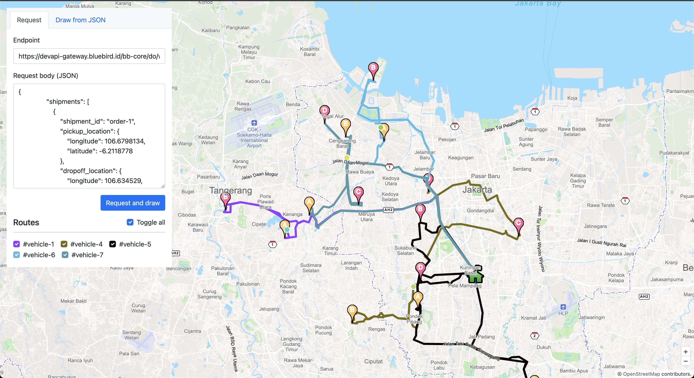

# Route Optimization


## Description

This project base on Google OR-Tools for optimization, tuned for tackling the world's toughest problems in vehicle routing.


## Features

- Propose best route


## Installation

Run Locally

Clone the project

```bash
  git clone https://github.com/bluebird-id/delivery-optimization.git
```

Go to the project directory

```bash
  cd ~/delivery-optimization
```

Install dependencies

Please refer to this link - [OR-Tools for .Net](https://developers.google.com/optimization/install/dotnet) for Installation package

Start the server

```bash
  dotnet run
```


## Demo

```
$ curl --location 'http://localhost:7000/v1/route' \
--header 'Content-Type: application/json' \
--data '{ request data example below }'
```

Example Request


```json
{
   "shipments":[
      {
         "shipment_id":"123-1",
         "pickup_location":{
            "longitude":106.6798134,
            "latitude":-6.2118778
         },
         "dropoff_location":{
            "longitude":106.634529,
            "latitude":-6.190571
         },
         "pickup_address":"jl.A",
         "dropff_address":"jl.B",
         "constraints":{
            "pickup_time_windows":{
               "start_time":"2023-01-04T08:00:57.4625198Z",
               "end_time":"2023-01-04T11:15:57.4625198Z"
            },
            "dropoff_time_windows":{
               "start_time":"2023-01-04T12:00:57.4625198Z",
               "end_time":"2023-01-04T19:43:57.4625198Z"
            },
            "demand":[
               {
                  "type":1,
                  "demand":1
               },
               {
                  "type":2,
                  "demand":10
               },
               {
                  "type":3,
                  "demand":2
               }
            ]
         },
         "info":"Test"
      }
   ],
   "vehicles":[
      {
         "vehicle_id":"123-1",
         "capacities":[
            {
               "type":1,
               "capacity":5
            },
            {
               "type":2,
               "capacity":50
            },
            {
               "type":3,
               "capacity":5
            }
         ],
         "start_location":{
            "longitude":106.82559983687916,
            "latitude":-6.246147633124191
         },
         "end_location":{
            "longitude":106.82559983687916,
            "latitude":-6.246147633124191
         },
         "load_time":10,
         "unload_time":10,
         "time_working":{
            "start_time":"2023-01-04T07:43:57.4625198Z",
            "end_time":"2023-01-04T18:43:57.4625198Z"
         }
      }
   ]
}
```

Example Response

```json
{
    "routes": [
        {
            "vehicleId": "123-1",
            "visits": [
                {
                    "type": 1,
                    "shipmentId": "123-1",
                    "eta": "2023-01-04T00:10:00Z",
                    "demand": [
                        {
                            "type": 1,
                            "demand": 1
                        },
                        {
                            "type": 2,
                            "demand": 10
                        },
                        {
                            "type": 3,
                            "demand": 2
                        }
                    ]
                },
                {
                    "type": 2,
                    "shipmentId": "123-1",
                    "eta": "2023-01-04T00:20:00Z",
                    "demand": [
                        {
                            "type": 1,
                            "demand": 0
                        },
                        {
                            "type": 2,
                            "demand": 0
                        },
                        {
                            "type": 3,
                            "demand": 0
                        }
                    ]
                }
            ]
        }
    ]
}
```

Demo with UI 

You can access http://localhost:7000/map/route



## License


```
Licensed under the Apache License, Version 2.0 (the "License");
you may not use this file except in compliance with the License.
You may obtain a copy of the License at

    http://www.apache.org/licenses/LICENSE-2.0

Unless required by applicable law or agreed to in writing, software
distributed under the License is distributed on an "AS IS" BASIS,
WITHOUT WARRANTIES OR CONDITIONS OF ANY KIND, either express or implied.
See the License for the specific language governing permissions and
limitations under the License.
```
